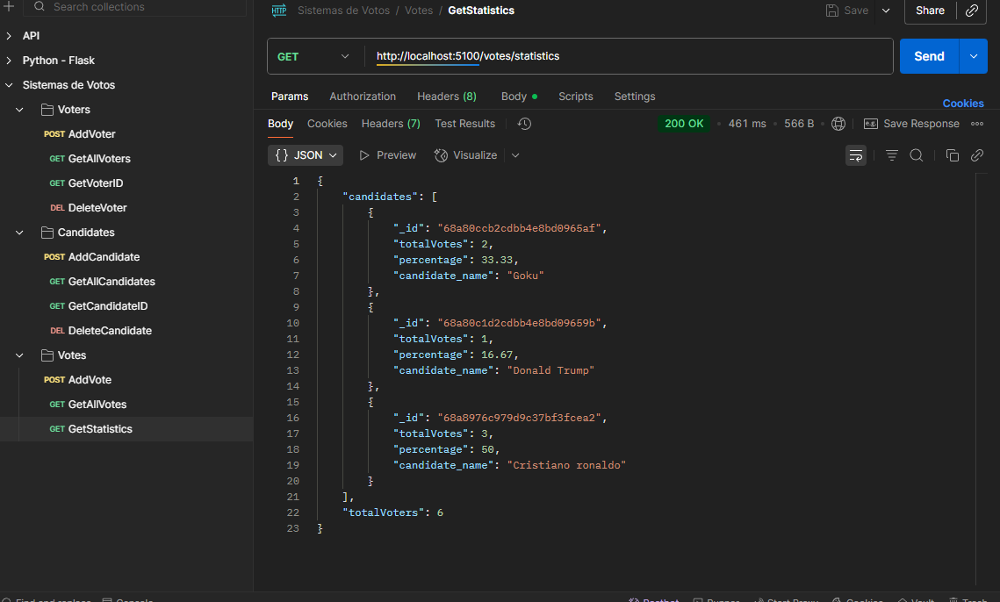

# Sistema de Votaciones

## Prerrequisitos
    - Node.js 
    - MongoDB Atlas
    - npm

## Instrucciones para configurar y ejecutar el proyecto

### 1. Clonar el repositorio

### 2. Instalar las dependencias
```bash
npm install
```

### 3. Configurar base de datos localmente

### 4. Configurar las variables de entorno (env)
Cambia los valores por los de tu base de datos.

```env
PORT = 5100
SERVER_DB = sistemadevotos.rzmmtox.mongodb.net
DB_PASSWORD = prueba
USER_DB = root
```

### 5. Ejecutar el servidor

 - npm run dev

## Ejemplos de uso del API con POSTMAN

### Votantes

#### 1. Registrar votante
 - Metodo: POST
 - URL : http://localhost:3000/voters

#### 2. Obtener todos los votantes
 - Metodo: GET
 - URL : http://localhost:3000/voters

#### 3. Obtener un votante por ID
 - Metodo: GET
 - URL : http://localhost:3000/voters/68a80b482cdbb4e8bd096582

#### 4. Eliminar votante
 - Metodo: DELETE
 - URL : http://localhost:3000/voters/68a80b482cdbb4e8bd096582

### Candidatos
#### 1. Registrar candidato
 - Metodo: POST
 - URL : http://localhost:3000/candidates

#### 2. Obtener todos los candidatos
 - Metodo: GET
 - URL : http://localhost:3000/candidates

#### 3. Obtener un candidato por ID
 - Metodo: GET
 - URL : http://localhost:3000/candidates/68a80ccb2cdbb4e8bd0965af

#### 4. Eliminar candidato
 - Metodo: DELETE
 - URL : http://localhost:3000/candidates/68a80ccb2cdbb4e8bd0965af

### Votos
#### 1. Registrar voto
 - Metodo: POST
 - URL : http://localhost:3000/votes

#### 2. Obtener todos los votos
 - Metodo: GET
 - URL : http://localhost:3000/votes

#### 3. Obtener las estadisticas de las votaciones
 - Metodo: GET
 - URL : http://localhost:3000/votes/statistics

### Captura de las estadisticas generadas



## Notas
 - Un votante solo puede votar una vez.
 - Un candidato no puede ser votante y viceversa.
 - Cuando un votante ya ha votado, no se le puede eliminar.
 - Cuando un candidato ya registra votos, no se le puede eliminar.
 - En las estadisticas, solo salen los candidatos que ya han recibido votos.